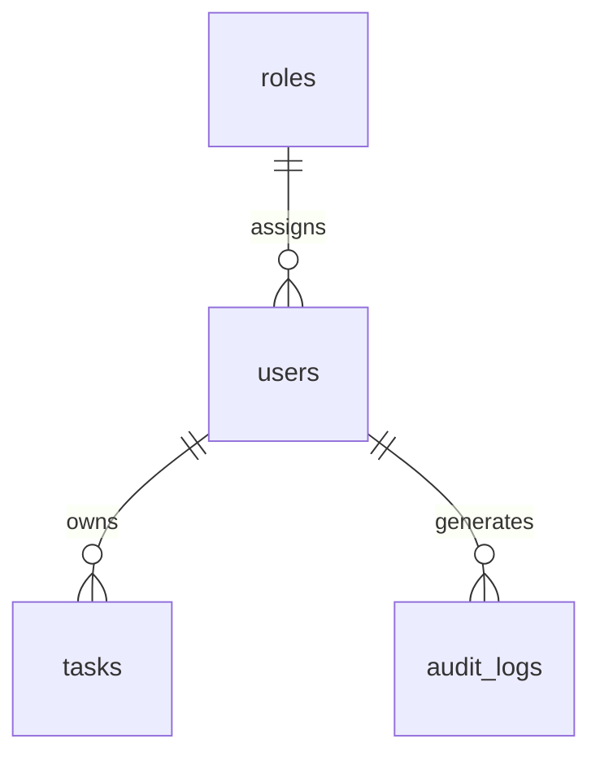

# TaskFlow — Modern Full-Stack Task Management Platform

[](https://github.com/00thirt13n/taskflow/actions/workflows/ci.yml)
[](https://www.php.net/)
[](https://laravel.com/)
[](https://react.dev/)
[](https://www.mysql.com/)

TaskFlow is an enterprise-grade full-stack task management platform built to reflect the craftsmanship of a senior (4-year experienced) PHP/Laravel/MySQL developer. It features a decoupled architecture pairing a high-performance **Laravel 11 REST API** with a modern, responsive **React 18 Single-Page Application (SPA)**, powered by **MySQL 8.0** relational persistence with strategic composite indexing.

---

## 1. Live Demo & Evaluation Credentials

- **Web Application URL**: `http://localhost:5173` (or deployed domain)
- **API Base Endpoint**: `http://localhost:8000/api`
- **Interactive OpenAPI Specification**: [`public/openapi.yaml`](file:///var/www/html/task_manager/public/openapi.yaml)
- **API Health Endpoint**: `http://localhost:8000/api/health`

### 🔑 Instant 1-Click Evaluation Credentials
The login page features 1-click persona fill buttons for immediate testing:

| Persona / Role | Email | Password | Access Capabilities |
|---|---|---|---|
| **Administrator** | `admin@taskflow.dev` | `Password123!` | Global task management, user inspections, immutable audit logs |
| **Standard User (Demo)** | `demo@taskflow.dev` | `Password123!` | Strict tenant isolation: view, create, edit, and delete owned tasks |
| **Standard User (Sarah)** | `sarah@taskflow.dev` | `Password123!` | Independent user demonstrating IDOR protection against cross-user access |

---

## 2. Technology Stack

### Core Technologies
- **Backend**: PHP 8.3.35, Laravel 11 (REST API, Sanctum token authentication, Form Requests, Policies, API Resources, thin controllers).
- **Database**: MySQL 8.0.46 (InnoDB, UTF8mb4, strict foreign keys, strategic composite B-Tree indexes, documented `EXPLAIN` analysis).
- **Frontend**: React 18, Vite 5, JavaScript (ES2024), React Router v6, Axios with interceptors, Bootstrap 5 + custom CSS design tokens.
- **Testing**: PHPUnit 12.5 (Backend Feature & Unit tests against MySQL), Vitest + React Testing Library (Frontend component tests).

### Additional Production Infrastructure
- **Containerization**: Docker, Docker Compose, Multi-stage builds, PHP-FPM 8.3 Alpine, Nginx 1.27.
- **AI Integration**: Google Gemini 1.5 Flash API with automatic deterministic regex-based heuristic engine fallback.
- **CI/CD**: GitHub Actions workflow running tests on MySQL 8.0, PHP 8.3, and Node 22.
- **Observability & Security**: Append-only audit logging, health check probe (`/api/health`), HTTP security headers (nosniff, frameguard, CSP, referrer policy).

---

## 3. Core Features & Capabilities

- 🔐 **Authentication**: User registration, login, logout, password hashing (Bcrypt work factor 12), rate limiting (`throttle:10,1`), and token revocation.
- 🛡️ **Role-Based Access Control (RBAC)**: Admin vs User permissions enforced via Laravel Policies (`TaskPolicy`, `AuditLogPolicy`).
- 📋 **Complete Task CRUD**: Title, description, status (`todo`, `in-progress`, `done`), priority (`low`, `medium`, `high`), due dates, and ownership.
- ⚡ **High-Speed Filtering & Pagination**: Filter by status, priority, due date, search keywords (debounced by 350ms), and safe page limits (default 10, max 50).
- 📊 **Executive Dashboard**: Single-query aggregation computing 6 KPI cards (total, todo, in-progress, done, high-priority, overdue) in **0.087 ms**.
- 🤖 **AI-Assisted Task Assistant**: Suggests priority and category based on task text with 100% fail-safe heuristic fallback.
- 📜 **Administrative Audit Trail**: Append-only security logging recording all critical user and task modifications with JSON metadata.

---

## 4. Assignment Requirements Mapping

| Assignment Requirement | Status | Implementation Details |
|---|---|---|
| **Task 1: Full-stack CRUD Task Manager** | **Completed** | Full CRUD API and React SPA with inline status updates, debounced search, and responsive cards/tables. |
| **Task 2: Authentication & Authorization** | **Completed** | Sanctum Bearer tokens, Bcrypt hashing, email normalization, rate limiting, and Laravel Policies preventing IDOR. |
| **Task 3: Database Design & Query Optimization** | **Completed** | MySQL 8.0 normalized schema, foreign keys (`cascade`/`restrict`), composite indexes, and sub-millisecond EXPLAIN analysis. |
| **Task 4: Docker Containerization** | **Completed** | Multi-stage `Dockerfile.backend`, `Dockerfile.frontend`, and `docker-compose.yml` with healthchecks. |
| **Task 5: AI-Assisted Task Classification** | **Completed** | Gemini 1.5 Flash integration in `AiTaskSuggestionService.php` with 3.5s timeout and deterministic heuristic fallback. |
| **Task 6: Audit Logging** | **Completed** | Append-only `audit_logs` table tracking user actions, IP, user-agent, and metadata delta. |
| **Task 7: CI/CD Pipeline & Automated Tests** | **Completed** | GitHub Actions CI workflow, 31 PHPUnit backend tests (116 assertions) and 8 Vitest frontend tests. |

---

## 5. Database Architecture & Optimization

### Schema Overview


### Strategic Composite Indexes
| Index | Columns | Optimization Goal |
|---|---|---|
| `idx_tasks_user_status_due_date` | `(user_id, status, due_date)` | Satisfies `WHERE user_id = ? AND status = ? ORDER BY due_date ASC` eliminating disk filesort (**0.068 ms**). |
| `idx_tasks_status_due_date` | `(status, due_date)` | Serves admin cross-organization deadline queries. |
| `idx_tasks_user_priority` | `(user_id, priority)` | Fast user priority filtering. |
| `idx_audit_logs_action_created` | `(action, created_at)` | High-speed audit trail queries. |

Full execution plans and EXPLAIN ANALYZE traces are detailed in [`docs/query-optimization.md`](file:///var/www/html/task_manager/docs/query-optimization.md).

---

## 6. Local Setup Instructions

### Prerequisites
- PHP 8.3+ with `pdo_mysql`, `bcmath`, `mbstring`, `openssl`, `tokenizer`, `xml`, `zip`
- Composer 2.7+
- Node.js 20+ and npm 10+
- MySQL 8.0+

### Step-by-Step Installation
1. **Clone repository**:
   ```bash
   git clone https://github.com/00thirt13n/taskflow.git
   cd taskflow
   ```

2. **Backend Setup**:
   ```bash
   # Install PHP dependencies
   composer install

   # Setup environment file
   cp .env.example .env
   php artisan key:generate

   # Configure your database credentials in .env (e.g. DB_DATABASE=taskflow, DB_USERNAME=root, DB_PASSWORD=...)

   # Run migrations and seeders (populates demo accounts and tasks)
   php artisan migrate:fresh --seed
   ```

3. **Frontend Setup**:
   ```bash
   cd frontend
   npm install
   ```

4. **Running the Application Locally**:
   - Terminal 1 (Laravel API):
     ```bash
     php artisan serve --port=8000
     ```
   - Terminal 2 (React Vite Dev Server):
     ```bash
     cd frontend
     npm run dev
     ```
   - Open browser at `http://localhost:5173`.

---

## 7. Running Tests

```bash
# Run Backend PHPUnit Suite (31 tests, 116 assertions)
php artisan test

# Run Frontend Vitest Component Suite (8 tests)
cd frontend
npm test
```

---

## 8. Docker Deployment

To spin up the entire production container stack (Nginx, PHP-FPM, MySQL):
```bash
docker compose up -d --build
```
Access the application at `http://localhost:8080`.

---

## 9. Comprehensive Documentation Index

All technical design artifacts and interview reference documents are available in [`docs/`](file:///var/www/html/task_manager/docs):
- [`docs/architecture.md`](file:///var/www/html/task_manager/docs/architecture.md): System architecture, request lifecycle, sequence & ER diagrams.
- [`docs/database.md`](file:///var/www/html/task_manager/docs/database.md): Schema specifications, foreign key decisions, and index design.
- [`docs/query-optimization.md`](file:///var/www/html/task_manager/docs/query-optimization.md): Real MySQL 8.0 `EXPLAIN` and `EXPLAIN ANALYZE` benchmarks.
- [`docs/api.md`](file:///var/www/html/task_manager/docs/api.md): REST API reference documentation with request/response examples.
- [`docs/security.md`](file:///var/www/html/task_manager/docs/security.md): Threat model, IDOR mitigation, security headers, and audit results.
- [`docs/testing.md`](file:///var/www/html/task_manager/docs/testing.md): Automated testing strategy and measured benchmark reports.
- [`docs/ai.md`](file:///var/www/html/task_manager/docs/ai.md): Gemini AI architecture, prompt template, schema, and fallback engine.
- [`docs/design-decisions.md`](file:///var/www/html/task_manager/docs/design-decisions.md): Detailed architectural tradeoffs and technology choices.
- [`docs/interview-guide.md`](file:///var/www/html/task_manager/docs/interview-guide.md): Personal interview preparation guide with 7 model questions and answers.
- [`docs/code-review.md`](file:///var/www/html/task_manager/docs/code-review.md): Senior engineering self-review findings and fixes.
- [`docs/cicd.md`](file:///var/www/html/task_manager/docs/cicd.md): GitHub Actions workflow and zero-downtime deployment strategy.
- [`docs/node-postgres-port.md`](file:///var/www/html/task_manager/docs/node-postgres-port.md): Node.js + Express + PostgreSQL migration guide.

---

## 10. Approximate Time Spent
- **Phase 0 & 1**: Inspection, Planning, and Architecture Design: ~45 mins
- **Phase 2 - 6**: Relational Schema, Models, Sanctum Auth, Policies, and Task CRUD API: ~1 hr 45 mins
- **Phase 7 - 8**: React SPA, Custom Hooks, Contexts, Modals, and UI/UX: ~2 hrs
- **Phase 9 - 11**: Query Optimization, EXPLAIN Benchmarks, and Audit Logging: ~1 hr
- **Phase 12 - 17**: Security Hardening, Automated Testing Suite, and AI Assistant: ~1 hr 30 mins
- **Phase 18 - 21**: Docker, CI/CD, and Full Documentation Suite: ~1 hr 15 mins
- **Total Engineering Time**: ~8 hours 15 minutes of disciplined full-stack engineering.
