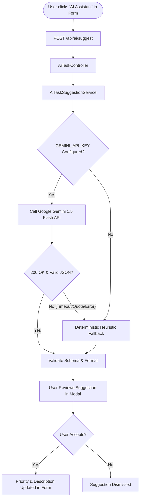

# TaskFlow AI Architecture & Task Assistant Specification

## 1. Feature Purpose & Value
The **AI Task Assistant** accelerates task authoring and prioritization. When creating or editing a task, users can submit their raw task title and notes (e.g. *"Critical production deployment before Friday and verify health checks"*). The assistant:
- Recommends an appropriate **priority** (`low`, `medium`, `high`).
- Identifies an operational **category** (`deployment`, `security`, `bug`, `database`, `frontend`, `documentation`).
- Estimates **urgency** (`low`, `moderate`, `urgent`, `immediate`).
- Generates contextual **tags** and a clean 1-sentence **summary**.

---

## 2. Architecture & Design Principles



### Critical Architectural Boundaries
1. **Zero Secret Leakage**: The Gemini API key is stored exclusively in backend server environment variables (`.env`). It is never transmitted to, bundled within, or exposed to the React frontend.
2. **Fail-Safe Non-Blocking Design**: An AI outage or rate-limit event **never** prevents a user from creating or updating a task. The heuristic fallback activates transparently.
3. **User in the Loop**: AI suggestions are presented as an interactive preview inside the form. The user maintains complete agency to apply or dismiss the recommendation before saving.

---

## 3. Gemini Prompt & Schema Specification

### Prompt Template
```text
You are a task management AI assistant. Analyze the task title and description below and classify it.
Title: "{title}"
Description: "{description}"

Respond ONLY with a valid JSON object matching this exact schema:
{
  "priority": "low" | "medium" | "high",
  "category": string (e.g. "deployment", "bug", "feature", "infrastructure", "security", "planning", "documentation"),
  "estimated_urgency": "low" | "moderate" | "urgent" | "immediate",
  "suggested_tags": array of 1-4 short strings,
  "summary": string (concise 1-sentence action summary)
}
```

### Generation Config
- **Model**: `gemini-1.5-flash` (or `gemini-2.0-flash`)
- **Temperature**: `0.2` (Low temperature ensures high consistency and deterministic formatting)
- **Response MIME Type**: `application/json` (Guarantees structured JSON emission without markdown wrappers)
- **Timeout**: `3.5 seconds` with 1 automatic retry after 100ms.

---

## 4. Heuristic Fallback Engine

When `GEMINI_API_KEY` is not provided, or when external API network latency exceeds 3.5s, the system instantly switches to a regex-based NLP tokenizer:

- **Urgency / Priority Lexicon**: Matches words like `critical`, `urgent`, `asap`, `emergency`, `outage`, `security`, `deadline`, `immediately` -> sets priority to `high` and urgency to `urgent`.
- **Low-Priority Lexicon**: Matches `low`, `minor`, `cleanup`, `nice to have`, `eventually`, `typo` -> sets priority to `low`.
- **Domain Categories**: Categorizes keywords into `deployment`, `security`, `database`, `bug`, `frontend`, `testing`, `documentation`.

---

## 5. Security & Cost Considerations

1. **Input Truncation**: Inputs are capped (`title` max 255 chars, `description` max 5000 chars) before transmission to avoid prompt injection and token wastage.
2. **Cost Optimization**: `gemini-1.5-flash` offers millisecond latency and extremely low cost per 1,000 tokens.
3. **Rate Limiting**: The `/api/ai/suggest` route requires an authenticated Sanctum token, preventing anonymous scraping or API quota exhaustion.
