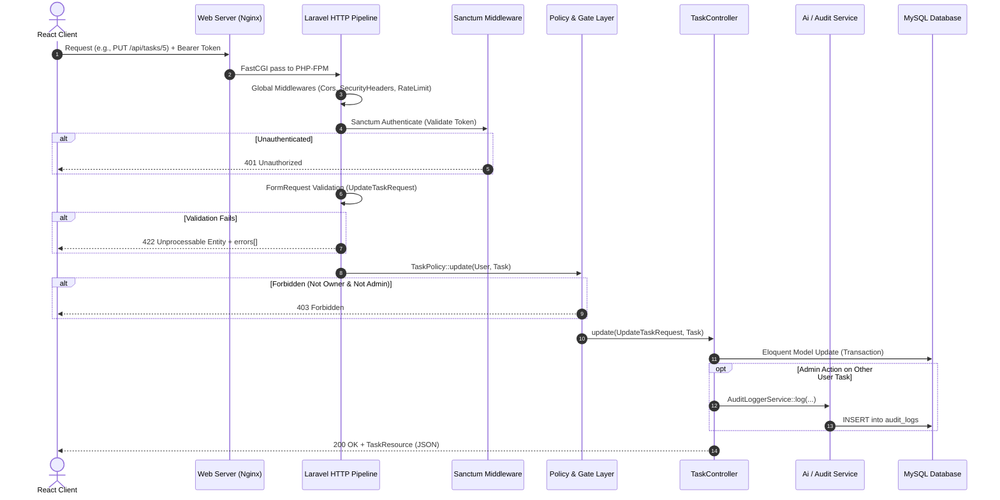
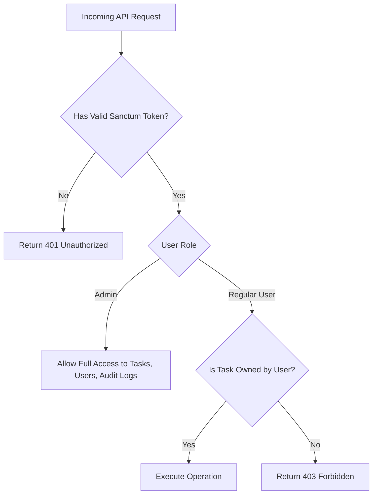
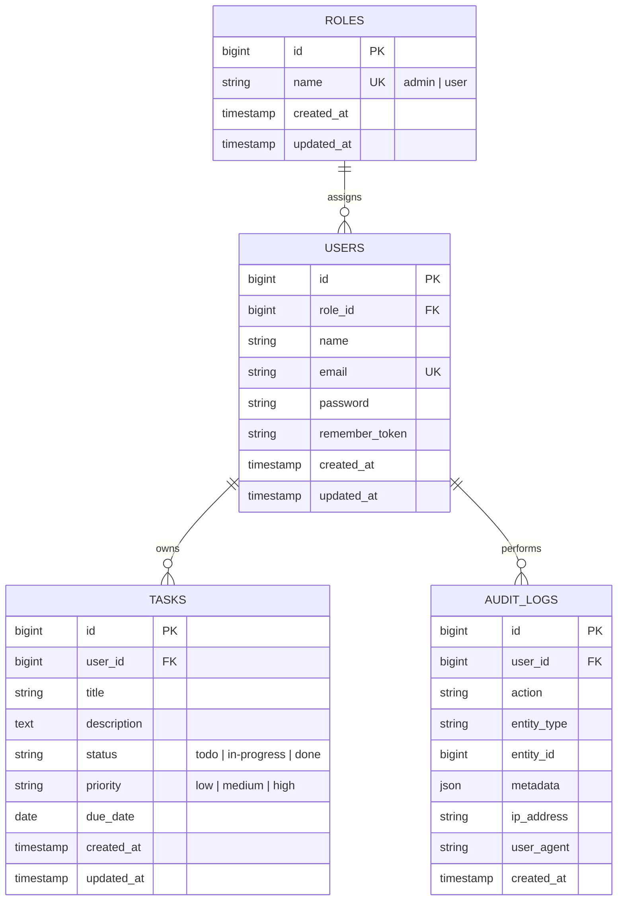

# TaskFlow System Architecture

## 1. System Overview
**TaskFlow** is structured as a decoupled Single-Page Application (SPA) with a RESTful backend API. It leverages Laravel 11 on PHP 8.3 for business logic and data persistence, paired with a React 18 (Vite-bundled) frontend client.

```mermaid
graph TD
    UserClient["Web Browser (React 18 SPA)"]
    ReverseProxy["Nginx Reverse Proxy / Load Balancer"]
    LaravelAPI["Laravel 11 REST API (PHP 8.3 FPM)"]
    MySQLDB[("MySQL 8.0 Database")]
    RedisCache[("Redis (Cache & Queue)")]
    GeminiAPI["Google Gemini AI API (Optional)"]

    UserClient -->|HTTPS /api/*| ReverseProxy
    UserClient -->|HTTPS /* (Static Assets)| ReverseProxy
    ReverseProxy -->|Proxy /api/*| LaravelAPI
    ReverseProxy -->|Serve Static HTML/JS/CSS| UserClient
    LaravelAPI -->|PDO / SQL| MySQLDB
    LaravelAPI -->|RESP Protocol| RedisCache
    LaravelAPI -->|HTTPS JSON Request| GeminiAPI
```

---

## 2. Request Lifecycle & Pipeline

Every incoming HTTP request to the API undergoes a strict, structured pipeline before reaching controllers:



---

## 3. Authentication & Authorization Flow

### Authentication (Laravel Sanctum)
- **Token-based API Authentication**: Uses lightweight, state-conscious Bearer tokens via Laravel Sanctum (`PersonalAccessToken`).
- **Registration**: Normalizes email to lowercase, validates password complexity (min 8 chars, mixed case/numbers), creates user with default `user` role, and issues token.
- **Login**: Compares hashed credentials with bcrypt via constant-time comparison, generates a single active session token, and records login timestamp.
- **Logout**: Revokes the current token (`$user->currentAccessToken()->delete()`).
- **Endpoint Protection**: Sanctum middleware (`auth:sanctum`) protects all `/api/tasks/*`, `/api/admin/*`, and `/api/me` routes.

### Authorization (RBAC with Policies)
Authorization strictly follows the principle of least privilege. There are two primary roles:
1. `admin`: Has global management capabilities (can view, update, delete any task, inspect user list, and view append-only audit logs).
2. `user`: Scoped strictly to their own data. Any attempt to read, modify, or delete another user's task returns a `403 Forbidden` (or `404 Not Found` when scoped via model queries).



---

## 4. Database Relationship Model



---

## 5. Frontend / Backend Communication Contract

- **Base URL**: `/api` (same origin or configured via `VITE_API_URL`).
- **Headers**:
  - `Accept: application/json`
  - `Content-Type: application/json`
  - `Authorization: Bearer <token>`
- **Standard Response Envelope**:
  - Single Resource: `{ "data": { ... } }`
  - Paginated Collection: `{ "data": [ ... ], "links": { ... }, "meta": { "current_page": 1, "last_page": 5, "total": 42 } }`
  - Standard Error: `{ "message": "The given data was invalid.", "errors": { "title": ["The title field is required."] } }`
  - Health Endpoint: `{ "status": "ok", "timestamp": "...", "database": "connected", "database_latency_ms": 1.2 }`

---

## 6. Deployment Architecture

For containerized and production deployments:
- **Nginx** handles TLS termination, HTTP-to-HTTPS redirect, serves pre-built static Vite bundle (`/usr/share/nginx/html`), and proxies `/api/*` requests to PHP-FPM.
- **PHP-FPM** executes Laravel API requests under non-root user `www-data` with opcache enabled.
- **MySQL 8.0** handles transactional persistence on an internal container network (port 3306 never exposed publicly).
