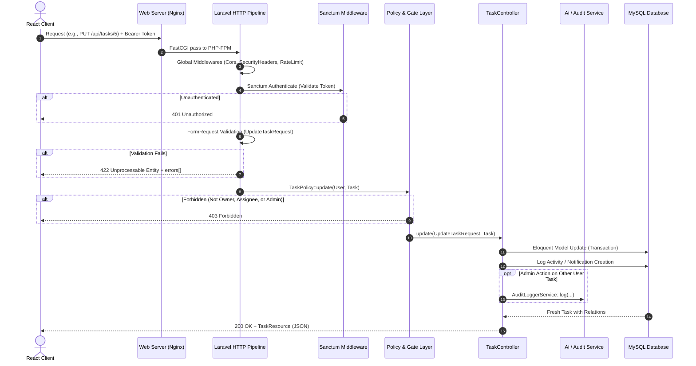

# TaskFlow System Architecture

## 1. System Overview
**TaskFlow** is structured as an enterprise-grade Single-Page Application (SPA) with a RESTful backend API. It leverages Laravel 11 on PHP 8.3 for business logic, transactional integrity, and data persistence, paired with a React 18 (Vite-bundled) frontend client adhering to a dense, modern SaaS design system.

```mermaid
graph TD
    UserClient["Web Browser (React 18 SPA)"]
    ReverseProxy["Nginx Reverse Proxy (SSL / Static Assets)"]
    LaravelAPI["Laravel 11 REST API (PHP 8.3 FPM)"]
    MySQLDB[("MySQL 8.0 Database (InnoDB)")]
    RedisCache[("Redis (Cache & Queue)")]
    GeminiAPI["Google Gemini AI API (Fallback Provider)"]

    UserClient -->|HTTPS /api/*| ReverseProxy
    UserClient -->|HTTPS /* (SPA Bundle)| ReverseProxy
    ReverseProxy -->|FastCGI / Proxy /api/*| LaravelAPI
    ReverseProxy -->|Serve Static HTML/JS/CSS| UserClient
    LaravelAPI -->|PDO / SQL| MySQLDB
    LaravelAPI -->|RESP Protocol| RedisCache
    LaravelAPI -->|HTTPS JSON Request| GeminiAPI
```

---

## 2. Information Architecture & Hierarchy

TaskFlow models real enterprise work management by transitioning away from flat task lists into a structured 4-tier domain hierarchy:

```
Organization / Team
    ↓
Workspace (e.g., "Acme Core Engineering")
    ↓
Projects (e.g., "Website Redesign", "Mobile App v2", "Infra & Security")
    ↓
Tasks (e.g., "WEB-101", "MOB-204", "INF-301")
    ↓
Subtasks  •  Dependencies  •  Discussions / Comments  •  Activity Logs
```

### Access & Role Hierarchy
- **System Level**:
  - `admin`: Global access to all projects, user management, audit logs, and system diagnostics.
  - `user`: Standard tenant member access.
- **Project Level**:
  - `owner`: Full project management and deletion rights.
  - `manager`: Task assignment, milestone definition, and member assignment.
  - `member`: Task creation, status updates, commenting, and subtask management.
  - `viewer`: Read-only access to boards, timelines, and reports.

---

## 3. Request Lifecycle & Security Pipeline

Every incoming HTTP request undergoes a strict pipeline before controller execution:



---

## 4. Frontend Architecture

### Component Hierarchy & Layouts
- **Layouts**:
  - `PublicLayout`: Clean marketing and authentication layout (Landing, Login, Register) with brand navigation.
  - `AppLayout`: Persistent sidebar, global header with workspace switcher, quick create trigger, notification center bell, and command palette (`Ctrl+K`).
- **State Strategy**:
  - `AuthContext`: Manages current user profile, tokens, login/logout transitions, and admin status.
  - `ThemeContext`: Manages light/dark mode persistence via `data-theme` attribute and `localStorage`.
  - Local component state: Multi-view modes, active filters, drawer open states, and drag-and-drop feedback.
- **Multi-View Engine**:
  - `Table View`: High information density, bulk selection toolbar, sortable columns, pagination.
  - `Board View (Kanban)`: Backlog, Todo, In Progress, Review, and Done swimlanes with HTML5 drag-and-drop and optimistic positioning updates.
  - `Calendar View`: Monthly grid highlighting due dates, milestones, and quick status badges.
  - `Timeline View`: Horizontal Gantt-style schedule visualizing start and target due dates with completion percentages.
- **Interactive Modals & Drawers**:
  - `TaskDetailDrawer`: Full slide-over experience showing metadata, checklist subtasks, blockers, comments feed, and activity timeline.
  - `TaskCreateModal`: Fast task creator with integrated AI natural language prompt parser.
  - `CommandPalette`: Modal with keyboard navigation across tasks, projects, and navigation shortcuts.

---

## 5. Backend Architecture & Clean Code Patterns

- **Thin Controllers**: Controllers orchestrate request validation, policy authorization, and resource serialization.
- **Form Requests**: All mutation payloads (`StoreTaskRequest`, `UpdateTaskRequest`, `BulkTaskRequest`) are validated at the edge before controller execution.
- **Service Layer**:
  - `AiTaskSuggestionService`: Encapsulates AI heuristics, Gemini API integration, JSON output extraction, and fallback rules.
  - `AuditLoggerService`: Immutable structured logging of sensitive actions with before/after state diffs, client IPs, and user agents.
- **API Resources**: `TaskResource` and `ProjectResource` normalize data representations and prevent accidental leakage of sensitive internal attributes (like password hashes).
- **Database Transactions**: Multi-step operations (e.g. bulk status changes + activity logging, project creation + owner membership assignment) run inside `DB::transaction()` closures to guarantee atomicity.

---

## 6. Real-Time Considerations & Scalability

### Current Architecture
- TaskFlow utilizes client-side polling and active event invalidation (refetching on mutation).
- All endpoints support ETag caching and conditional HTTP headers for optimal network efficiency.

### Future Real-Time Roadmap
- **Broadcasting Layer**: Laravel Echo + Pusher / Soketi (open-source WebSockets server).
- **Channels**:
  - `private-workspace.{id}`: Broadcasts task movement across Kanban boards to all active team members.
  - `private-user.{id}`: Pushes real-time notification toasts when tasks are assigned or comments are posted.
- **Fallback Strategy**: Server-Sent Events (SSE) for low-overhead unidirectional updates (such as AI progress streaming).
