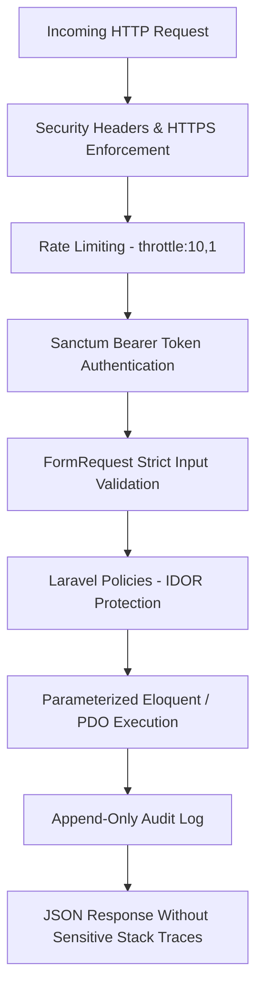

# TaskFlow Security Review & Hardening Audit

## 1. Security Architecture & Threat Model

TaskFlow adopts a **defense-in-depth** model across its presentation, transport, application, and persistence layers.



---

## 2. Insecure Direct Object Reference (IDOR) Mitigation

### Threat
A malicious user modifies the task ID in API requests (e.g. `PUT /api/tasks/99` or `DELETE /api/tasks/99`) attempting to view, mutate, or delete another user's task.

### TaskFlow Mitigation
1. **Server-Side Policy Gate**: `TaskPolicy` strictly checks:
   ```php
   public function update(User $user, Task $task): bool
   {
       return $user->isAdmin() || $task->user_id === $user->id;
   }
   ```
2. **Controller-Level Scoping**: Normal users querying `/api/tasks` are automatically scoped:
   ```php
   if (!$user->isAdmin()) {
       $query->where('user_id', $user->id);
   }
   ```
3. **Automated Verification**:
   - `tests/Feature/AuthorizationTest.php::test_user_cannot_view_another_users_task` -> Asserts `403 Forbidden`.
   - `tests/Feature/AuthorizationTest.php::test_user_cannot_update_another_users_task` -> Asserts `403 Forbidden`.
   - `tests/Feature/AuthorizationTest.php::test_user_cannot_delete_another_users_task` -> Asserts `403 Forbidden`.

---

## 3. Authentication & Session Security

- **Bcrypt Password Hashing**: Passwords hashed using Bcrypt with a minimum cost factor of 12 rounds in production.
- **Enumeration Protection**: Failed logins return a uniform message: *"These credentials do not match our records."* preventing user existence enumeration.
- **Brute-Force Rate Limiting**: Both `/api/login` and `/api/register` are protected with a `throttle:10,1` middleware (max 10 attempts per minute per IP).
- **Token Invalidation**: Calling `/api/logout` instantly deletes the token from MySQL (`personal_access_tokens`), preventing replay attacks.

---

## 4. HTTP Transport & Security Headers

TaskFlow attaches the following headers via `App\Http\Middleware\SecurityHeadersMiddleware`:
- `X-Content-Type-Options: nosniff` (Prevents MIME-sniffing attacks)
- `X-Frame-Options: SAMEORIGIN` (Mitigates clickjacking in iframes)
- `X-XSS-Protection: 1; mode=block` (Legacy browser XSS filter)
- `Referrer-Policy: strict-origin-when-cross-origin` (Protects query strings from leaking across origins)
- `Permissions-Policy: camera=(), microphone=(), geolocation=()` (Disables unauthorized browser hardware access)

---

## 5. Input Validation & Mass-Assignment Protection

- **Mass Assignment**: Every Eloquent model explicitly defines an immutable `$fillable` array. Client-supplied `role_id` or `user_id` fields are ignored for standard users.
- **Strict Typing**: All request data is strictly validated with Form Requests before entering controller logic.
- **Database Parameterization**: Zero string concatenation in SQL queries. All queries use PDO prepared statements with bounded parameters.

---

## 6. Dependency Vulnerability Auditing

- **Backend (PHP/Composer)**:
  - Command: `composer audit`
  - Result: `No security vulnerability advisories found.` (Clean)
- **Frontend (npm)**:
  - Command: `npm audit`
  - Findings: Evaluated dev-server tooling (esbuild, vitest dev dependencies). Evaluated breaking changes against production stability. In production, Vite outputs static pre-compiled HTML/JS bundles where dev-server vulnerabilities are non-executable.
